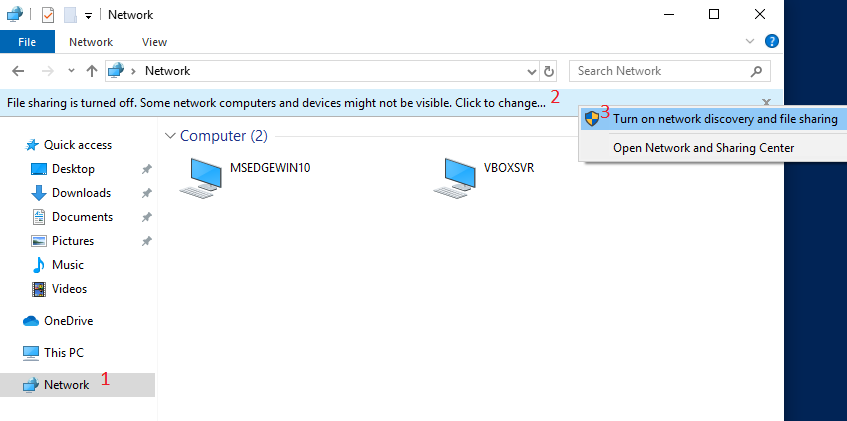

# unicorndvc-demo-setup
This repo contains two scripts:
- A bash script to create two VirtualBox VMs
- PowerShell scripts to set up the [UnicornDVC test app](https://github.com/BabbageCom/unicorndvctestapp/) and install dependencies

## Prerequisites
- [VirtualBox](https://virtualbox.org/wiki/Downloads)
- [Microsoft Edge Windows 10 VM image](https://developer.microsoft.com/en-us/microsoft-edge/tools/vms/)

## Creating the VMs
To set up virtual machines, run `virtualbox-setup` and pass to it one or more machine names to be created. The script will:
- Create/configure VMs
- Mount a shared drive (`Z:`) containing this repo (which allows running the PowerShell scripts inside the machine)
- Mount the [Guest Additions](https://docs.oracle.com/cd/E36500_01/E36502/html/qs-guest-additions.html) .iso in the machine DVD drive for easy installation

NOTE: It is assumed that the VM image and its related .ovf file are located in `~/Downloads/MSEdge - Win10/`. If you extracted these files to another location, you can specify it by modifying the script.  

In addition, you can change the machine parameters (RAM, VRAM, CPU, etc) by modifying the relevant parameters in the script.  

## Setting up the VMs
Once the machines are created: start them, run PowerShell as Administrator, and run `Install-Requirements.ps1` (which should be found on `Z:`). This script will:
- Install prerequisites including git, .NET Framework 3.5 (required by UnicornDVC libraries) and dotnet core 3.1 (required by the demo app)
- Run `Setup-UnicornTestApp.ps1` which will clone the demo app repo and launch the UnicornDVC installer.

Before you can use RDP and run the demo app, you will need to:
- (Optional) change each machine's hostname to help differentiate between the two
- Enable Remote Desktop on the server machine
- Enable network discovery and file sharing. This can be done through Explorer:

